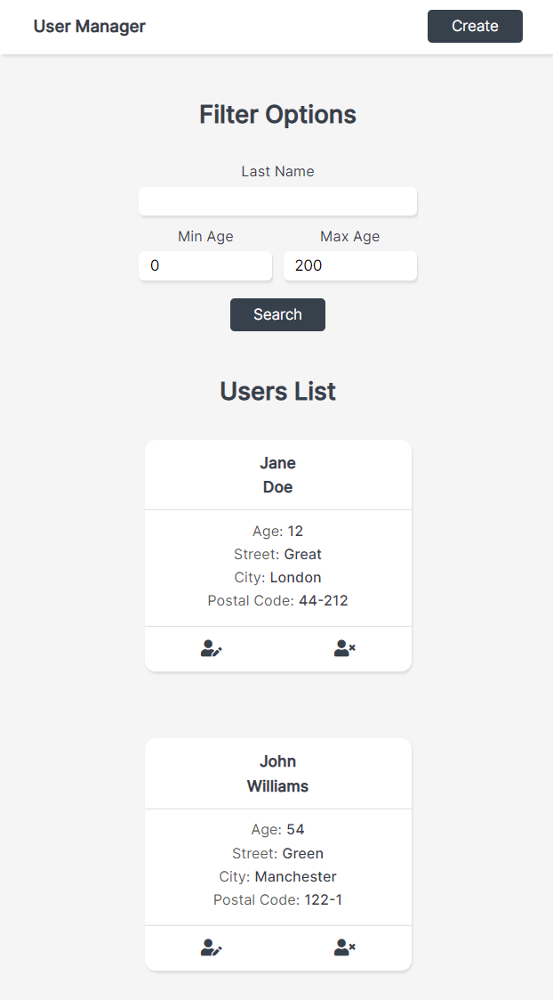
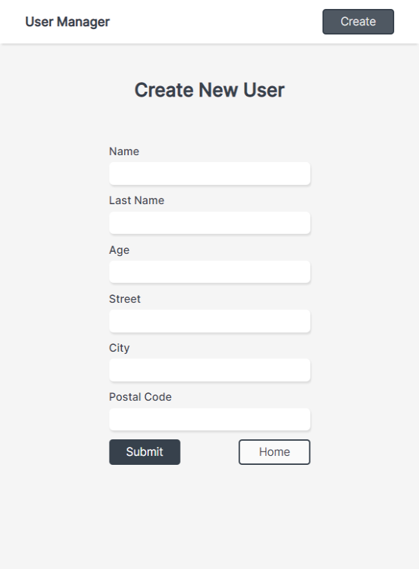
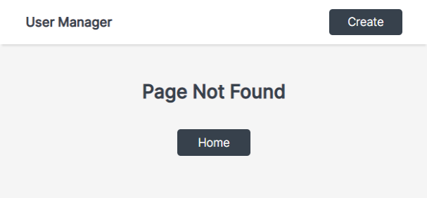

# User Manager

[live](https://fervent-morse-4074f5.netlify.app/)

## Views:

### Home desktop:

### Home mobile:

### Form:

### Error:

## Functionality:

### Nav:

- 'User Manager' link pushes user to '/' (Home)

- 'Create' button pushes user to '/create' (Create New User Form)

### Home:

#### List of users:

- User Card contains info about user

- after clicking at left button at User Card user will be pushed to '/edit/:id' (Edit User Form)

- after clicking at right button at User Card choosen User will get deleted

#### Filter:

a) user can filter data by last name (input at top) or by age (two inputs at bottom)

b) After successful operation user data will get filtred, if operation will fail user will see error message

c) validation:

- last name can only contain letters, cannot contain whitespace characters and cannot be empty

- min age cannot be higher then max age

- min age and max age range: 0 - 200

### Create and Edit:

a) user can come back to Home page by clicking 'Home' button

b) user can submit form by clicking 'Submit' button, after successful operation user will see success message,
if operation will fail user will see error message

c) validation:

- last name can only contain letters, cannot contain whitespace characters and cannot be empty

### Error types:

- Page Not Found if user types wrong path

- Record Not Found if user types wrong id in '/user/:id' path
